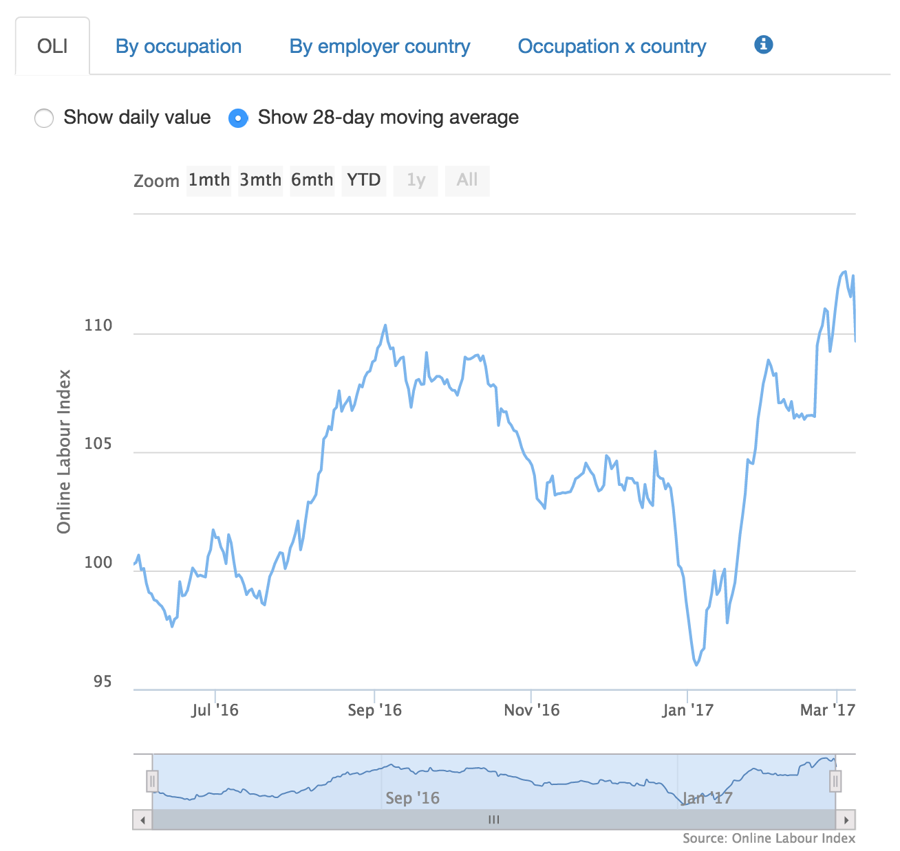
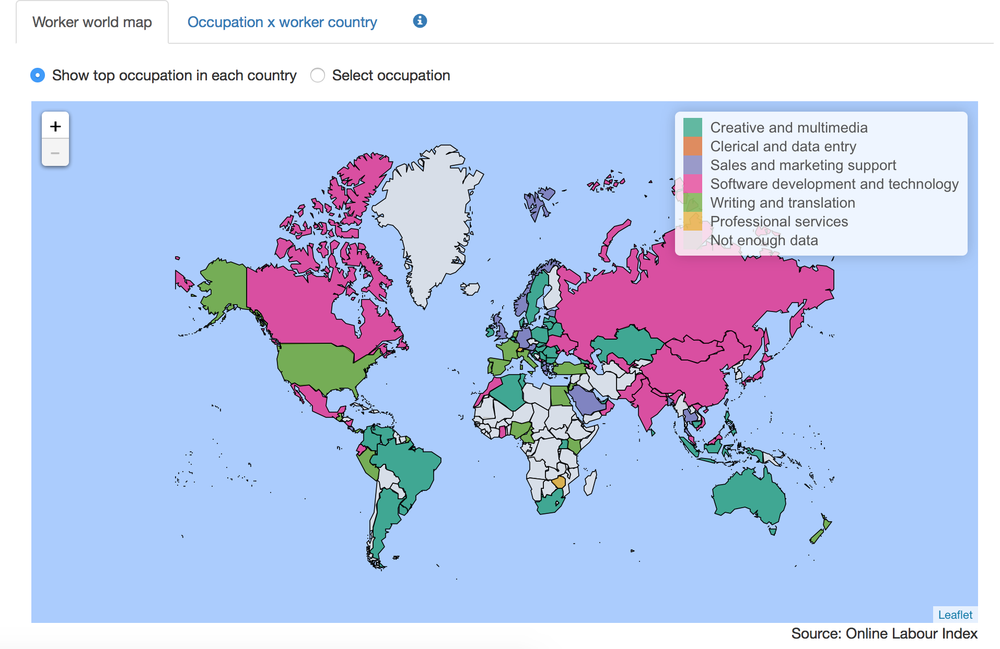

# Online Labour Index

The Online Labour Index (OLI) is the first economic indicator that provides an online gig economy equivalent of conventional labour market statistics. It measures the utilization of online labour across countries and occupations by tracking the number of projects and tasks in real time. Read more about the project at [ilabour.oii.ox.ac.uk/online-labour-index](ilabour.oii.ox.ac.uk/online-labour-index).

This repository contains the code for two Shiny apps developed and hosted by Oxford University's [Interactive Data Network](http://idn.it.ox.ac.uk). Shiny is a framework for developing interactive web applications using the scripting language R.

The data behind the apps is deposited nightly to this Figshare deposit: [https://dx.doi.org/10.6084/m9.figshare.3761562](https://dx.doi.org/10.6084/m9.figshare.3761562).

This code is deposited on Figshare here: [http://doi.org/10.6084/m9.figshare.5554177](http://doi.org/10.6084/m9.figshare.5554177)

## Employer Dashboard

The employer dashboard was initially designed developed as a [case study](http://idn.it.ox.ac.uk/article/online-labour-index-case-study) for the Live Data project, which spawned the Interactive Data Network. 

</img>

There are four views of the data:

- The Online Labour Index
- Posted jobs split by occupation type
- Posted jobs split by country
- Intra-country/job breakdowns

## Worker Dashboard

The worker dashboard was developed by the IDN on behalf of Prof. Vili Lehdonvirta and Dr. Otto Kässi. 

</img>

# Attribution

Code is made available subject to a MIT license, the following copyright and attribution should be respected when reusing the code

- Copyright Owner: University of Oxford
- Date of Authorship: 2016
- Data: [https://dx.doi.org/10.6084/m9.figshare.3761562](https://dx.doi.org/10.6084/m9.figshare.3761562)
- Academic Contact: Otto Kässi and Vili Lehdonvirta
- Developer: Martin John Hadley